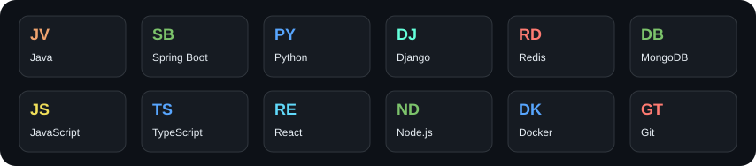

  

  <b>A not-so-boring software developer.</b> 
  I build APIs, connect the pieces, and occasionally tell a request to come back later.

  <a href="https://www.linkedin.com/in/ak74ay/">LinkedIn</a> &nbsp; / &nbsp;
  <a href="mailto:pantakshay00@gmail.com">Email</a> &nbsp; / &nbsp;
  <a href="https://leetcode.com/ak74ay/">LeetCode</a>

  <a href="#-the-project-tour">Projects</a> &nbsp; / &nbsp;
  <a href="#-my-toolbox">Toolbox</a> &nbsp; / &nbsp;
  <a href="#-by-the-numbers">Stats</a> &nbsp; / &nbsp;
  <a href="#-side-quests">Side quests</a>

### 👋 A little context

Java and **Spring Boot** are my home base. I also build with **Django**, **Node.js**, and **React**, with the occasional detour into mobile apps.

My repositories range from CSS experiments to document processing, multilingual APIs, and Redis rate limiting. I like projects where the interesting part lives behind the button.

💬 **Talk to me about:** Spring Boot, Django, API design, or the tradeoffs behind a small system.

### 🚀 The project tour

<table>
<tr>
<td width="50%" valign="top">
<h3>📂 File Nest</h3>

<b>Turn documents into text.</b>

File management and text extraction from images, PDFs, and Office documents, with authentication and email verification.

<code>Spring Boot</code> <code>MongoDB</code> <code>Tesseract</code> <code>React</code>

<a href="https://github.com/ak74aytg/file-nest-backend">Explore the backend →</a> · <a href="https://github.com/ak74aytg/file-nest-frontend">Frontend</a>

</td>
<td width="50%" valign="top">
<h3>🚦 Rate Limiter</h3>

<b>Sometimes the right answer is “slow down.”</b>

A sliding-window rate limiter using Redis sorted sets and a Lua script to check and record requests atomically.

<code>Java</code> <code>Spring Boot</code> <code>Redis</code> <code>Lua</code>

<a href="https://github.com/ak74aytg/RateLimiter">Follow a request →</a>

</td>
</tr>
<tr>
<td width="50%" valign="top">
<h3>🌐 Multilingual FAQ API</h3>

<b>One question. Three languages.</b>

An FAQ backend with English, Hindi, and Bengali support, automatic translation, rich text, and Redis caching.

<code>Python</code> <code>Django REST Framework</code> <code>Redis</code>

<a href="https://github.com/ak74aytg/FAQ-multilingual-traslation">Try a different language →</a>

</td>
<td width="50%" valign="top">
<h3>📱 Keep Jobs</h3>

<b>Find it now. Bookmark it for later.</b>

A mobile job browser with paginated listings, job details, and SQLite bookmarks that survive an app restart.

<code>React Native</code> <code>Expo</code> <code>SQLite</code>

<a href="https://github.com/ak74aytg/keep_jobs">See the app &amp; screenshots →</a>

</td>
</tr>
</table>

<b>🧭 Take the scenic route — more projects</b>

 

| Project | What's inside |
| :--- | :--- |
| [Feed4Me backend](https://github.com/ak74aytg/feed4me-server) | APIs for farmers, customers, and storage providers; OTP registration, crop inventory, and chat. |
| [Design Patterns](https://github.com/ak74aytg/Design-Patterns) | A Java learning project modeling cloud storage providers through shared interfaces and creational patterns. |
| [Real-time chat](https://github.com/ak74aytg/basic-chat-app-backend) | Node.js, Express, and Socket.IO messaging, with a [React frontend](https://github.com/ak74aytg/basic-chat-app-frontend). |
| [Task Management System](https://github.com/ak74aytg/Task-Management-System) | Task creation, assignment, updates, and deletion with Spring Boot and a [React frontend](https://github.com/ak74aytg/task-management-system-frontend). |
| [REST Countries](https://github.com/ak74aytg/rest-country-api) | A frontend API challenge from the earlier chapters of my GitHub. |

[Browse all repositories →](https://github.com/ak74aytg?tab=repositories)

### 🧰 My toolbox

  

  <b>Backend:</b> Spring Boot · Django REST Framework · Express 
  <b>Interfaces:</b> React · React Native · HTML &amp; CSS 
  <b>Data:</b> MongoDB · MySQL · Redis · SQLite

### 🎮 Side quests

- **Practice arena:** [Data structures & algorithms in Java](https://github.com/ak74aytg/Data-Structure-and-Algorith-with-Java) · [Contest solutions](https://github.com/ak74aytg/contests) · [LeetCode](https://leetcode.com/ak74ay/)
- **Design detour:** [Cloud storage abstractions in Java](https://github.com/ak74aytg/Design-Patterns)

<b>🏴‍☠️ You found the post-credits scene</b>

 

   
  Zoro handles the swords. I handle the endpoints.

---

  <b>Have an interesting API problem or a project idea?</b> 
  <a href="mailto:pantakshay00@gmail.com">Let's talk →</a>

<!-- Banner generated with https://github.com/kyechan99/capsule-render and bundled locally. Stats and toolbox are local SVGs. See SETUP.md for the daily refresh workflow. Zoro GIF retained from the original profile. -->
